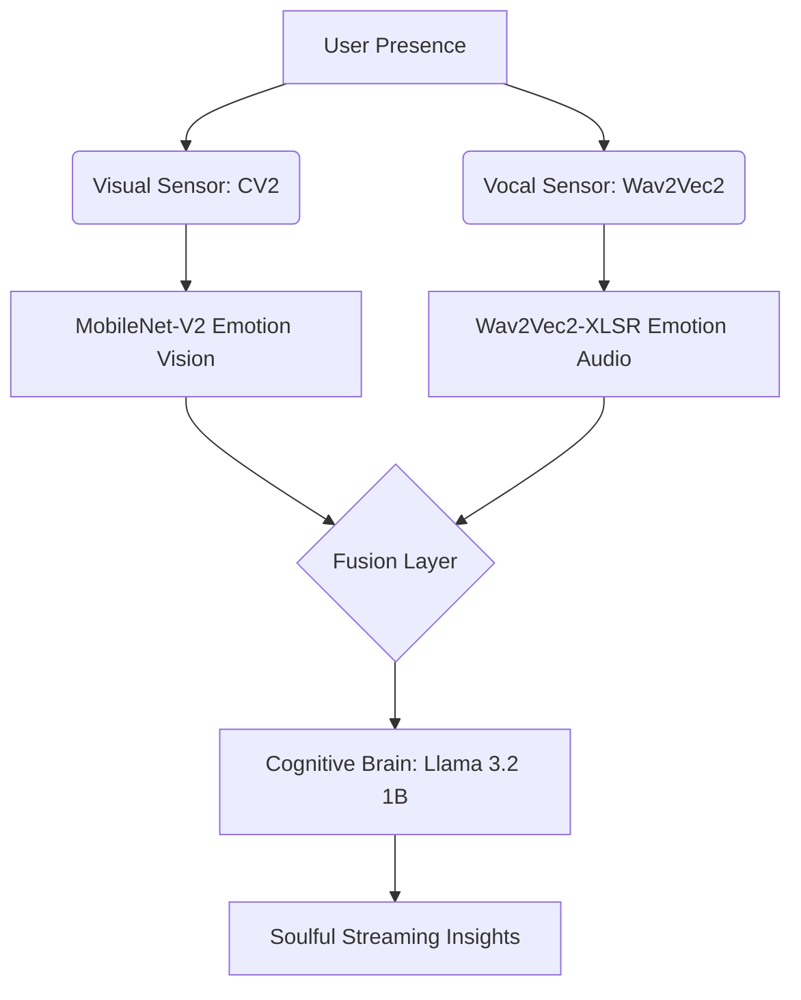

# <p align="center">✨ Aura AI – Resonating Presence</p>

<p align="center">
  
  
  
  
</p>

<p align="center">
  <b>A premium, high-fidelity AI assistant for emotional resilience and mental wellness.</b><br>
  <i>Harmonizing facial presence and vocal frequency into Soulful Insights.</i>
</p>

---

## 🌌 The Vision
Aura AI (formerly MAITRI) is designed for high-stakes environments where emotional clarity is mission-critical. Using state-of-the-art vision and audio foundation models, Aura perceives the subtle nuances of your presence to provide empathetic, real-time guidance—all while remaining **100% air-gapped** for absolute privacy.

## 🎨 Premium Experience: Ultra Modern UI
*   **Atmospheric Dark Slate**: High-contrast, serene design optimized for focus.
*   **Ethereal Glassmorphism**: High-fidelity blurred interfaces and fluid transitions.
*   **Zen-Style Inputs**: Minimalist camera and voice sensors for a non-intrusive experience.
*   **Dynamic Visuals**: 0.3s micro-animations and real-time inference streaming.

## 🧠 Technical Architecture



- **Visual Brain**: MobileNet-V2 vision backbone for sub-second facial analysis.
- **Vocal Brain**: XLSR-based audio classification for deep vocal frequency sensing.
- **Cognitive Engine**: Llama 3.2 (1B) optimized via Ollama for efficient local inference.
- **Core Stack**: FastAPI (Async Backend), Streamlit (Modern Frontend), Docker.

---

## 🚀 Quick Start (Local)

### 1. 🧬 Prepare Environment
```bash
python -m venv .venv
# Windows: .venv\Scripts\activate | Unix: source .venv/bin/activate
pip install -r requirements.txt
```

### 2. 🧠 Pre-cache Intelligence
Download all required AI models for offline operation:
```bash
python scripts/setup_offline.py
```

### 3. ✨ Launch Aura
**Standard Run:**
```bash
# Start Backend
uvicorn backend.main:app --host 0.0.0.0 --port 8000
# Start Frontend (In new terminal)
streamlit run streamlit_app.py
```

---

## 🐳 Docker Deployment (One-Click)
Deploy the entire Aura stack (Backend + Frontend + Ollama) using Docker Compose:
```bash
docker-compose up --build
```

---

## 🌐 Cloud Deployment
Pre-configured for seamless hosting:
- **Streamlit Cloud**: Connect this repo and point to `streamlit_app.py`.
- **HuggingFace Spaces**: Compatible with Docker SDK templates.
- **GitHub Ready**: `.gitignore` optimized to keep your repository clean of heavy binary blobs.

---

[Implementation Plan](file:///C:/Users/Himanshu/.gemini/antigravity/brain/d7392ed3-520f-444a-9899-9de3b7eddc01/implementation_plan.md) | [Walkthrough](file:///C:/Users/Himanshu/.gemini/antigravity/brain/d7392ed3-520f-444a-9899-9de3b7eddc01/walkthrough.md) | [Final Task](file:///C:/Users/Himanshu/.gemini/antigravity/brain/d7392ed3-520f-444a-9899-9de3b7eddc01/task.md)
